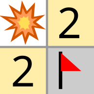
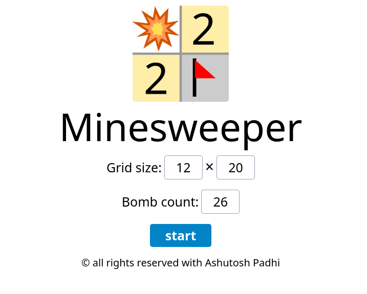
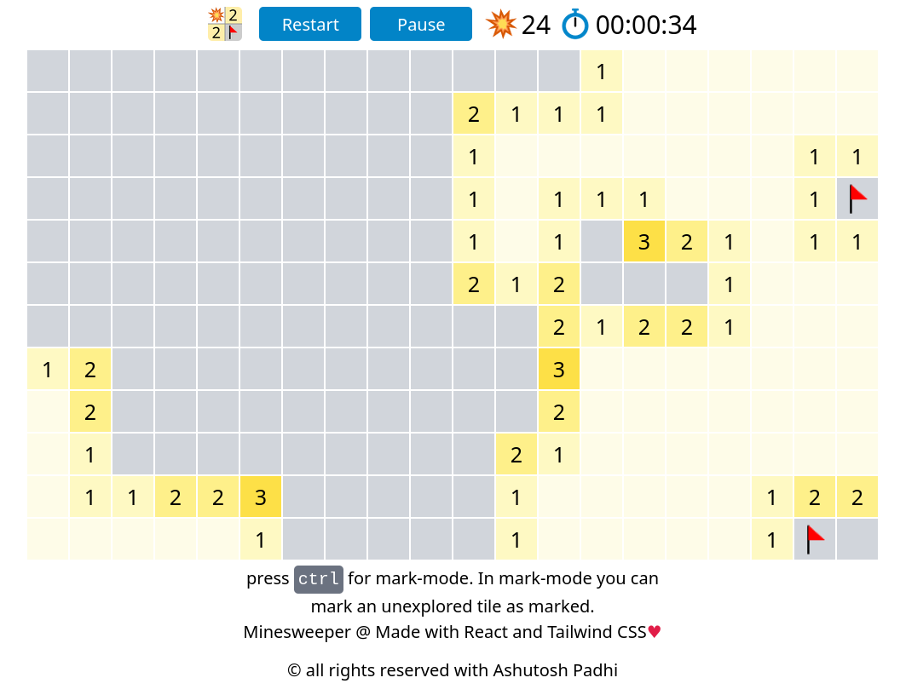
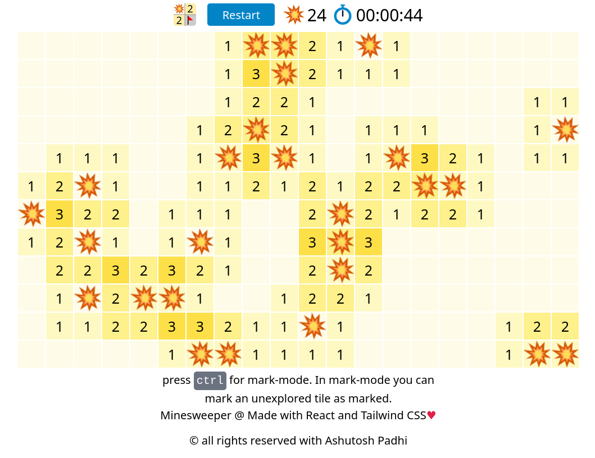

# Minesweeper

        

A trivial implementation of minesweeper game in **React**. I have made this to sharpen my react skill. All the art works are made in **Inkscape**.

## Getting Started

---

1. clone the repo
2. `npm start`

This react app is not ejected so all valid react commands will work here too.

## Screenshots of a typical game play

---

        

        

        

